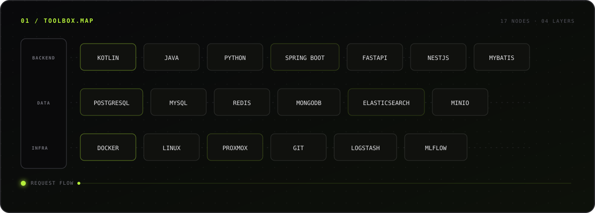
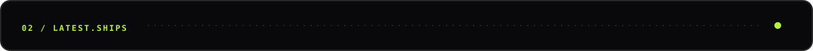
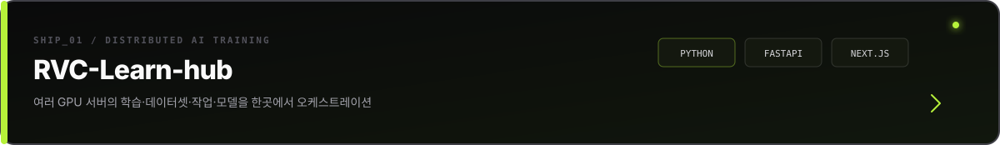
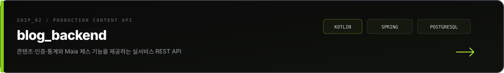
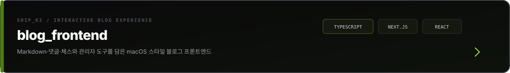
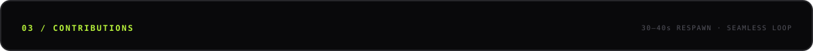

  

  
  &nbsp;
  

 

  

 

  

 

  

 

  

<picture>
  <source media="(prefers-color-scheme: dark)" srcset="https://raw.githubusercontent.com/ParkWonYeop/ParkWonYeop/output/breakout-contribution-graph-dark.svg" />
  <source media="(prefers-color-scheme: light)" srcset="https://raw.githubusercontent.com/ParkWonYeop/ParkWonYeop/output/breakout-contribution-graph.svg" />
  
</picture>

 

  

