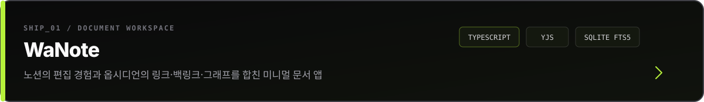
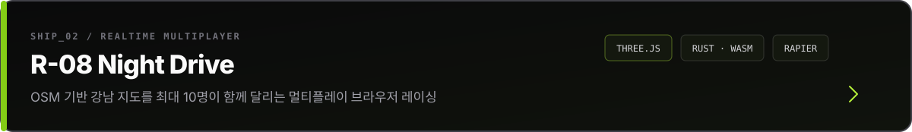
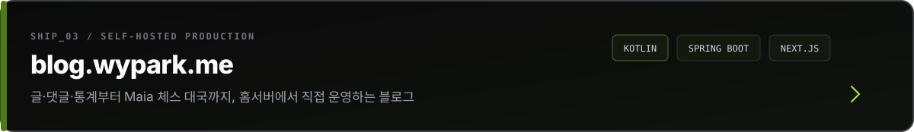

  <picture>
    <source media="(max-width: 600px)" srcset="./assets/hero-mobile.svg" />
    
  </picture>

  <a href="https://blog.wypark.me"><picture><source media="(max-width: 600px)" srcset="./assets/link-blog-mobile.svg" /></picture></a>
  &nbsp;
  <a href="mailto:wyp9679@gmail.com"><picture><source media="(max-width: 600px)" srcset="./assets/link-email-mobile.svg" /></picture></a>

복잡한 문제를 직시하고 끝까지 추적하는 백엔드 엔지니어입니다. 
병목을 재서 줄이고, 레거시를 안전하게 바꾸고, Proxmox 홈서버에서 직접 운영하며 장애에 강한 시스템을 만듭니다.

**Main** &nbsp; Kotlin · Spring Boot · PostgreSQL · Docker 
**Also** &nbsp; Java · Python · TypeScript · FastAPI · NestJS · MyBatis · MySQL · Redis · MongoDB · Elasticsearch · MinIO · Linux · Proxmox · Git · Logstash · MLflow

### Projects

<a href="https://github.com/ParkWonYeop/wnote">
  <picture>
    <source media="(max-width: 600px)" srcset="./assets/project-wnote-mobile.svg" />
    
  </picture>
</a>

<a href="https://www.wanote.net">wanote.net</a> · <a href="https://github.com/ParkWonYeop/wnote">GitHub</a>

<a href="https://github.com/ParkWonYeop/r08">
  <picture>
    <source media="(max-width: 600px)" srcset="./assets/project-r08-mobile.svg" />
    
  </picture>
</a>

<a href="https://race.wanote.net/?server=1">바로 플레이</a> · <a href="https://github.com/ParkWonYeop/r08">GitHub</a>

<a href="https://github.com/ParkWonYeop/blog_backend">
  <picture>
    <source media="(max-width: 600px)" srcset="./assets/project-blog-mobile.svg" />
    
  </picture>
</a>

<a href="https://blog.wypark.me">blog.wypark.me</a> · <a href="https://github.com/ParkWonYeop/blog_backend">backend</a> · <a href="https://github.com/ParkWonYeop/blog_frontend">frontend</a>

### Latest posts

<!-- posts:start -->
- [감시자를 감시하는 감시자를 감시하는 감시자를..](https://blog.wypark.me/posts/%EA%B0%90%EC%8B%9C%EC%9E%90%EB%A5%BC-%EA%B0%90%EC%8B%9C%ED%95%98%EB%8A%94-%EA%B0%90%EC%8B%9C%EC%9E%90%EB%A5%BC-%EA%B0%90%EC%8B%9C%ED%95%98%EB%8A%94-%EA%B0%90%EC%8B%9C%EC%9E%90%EB%A5%BC..) · 2026-09-05
- [여보세요? 음성 통화 서버를 구축하고 싶습니다](https://blog.wypark.me/posts/%EC%97%AC%EB%B3%B4%EC%84%B8%EC%9A%94-%EC%9D%8C%EC%84%B1-%ED%86%B5%ED%99%94-%EC%84%9C%EB%B2%84%EB%A5%BC-%EA%B5%AC%EC%B6%95%ED%95%98%EA%B3%A0-%EC%8B%B6%EC%8A%B5%EB%8B%88%EB%8B%A4) · 2026-07-11
- [RTR (Refresh Token Rotation)](https://blog.wypark.me/posts/rtr-%28refresh-token-rotation%29) · 2026-01-02
<!-- posts:end -->

 

