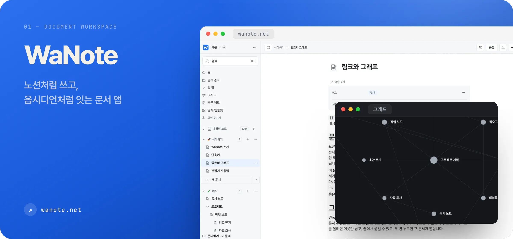
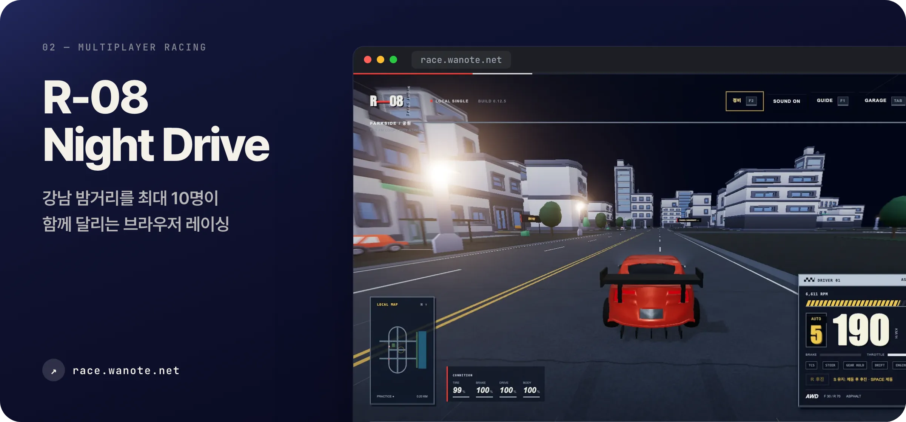
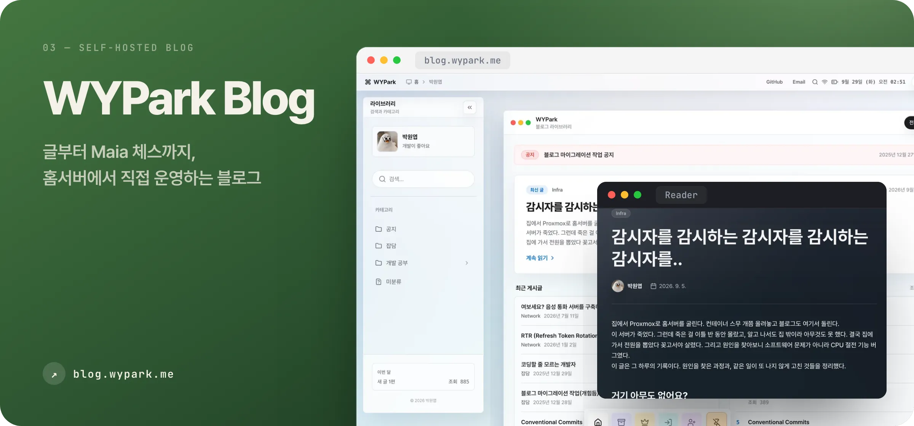

<a href="https://blog.wypark.me">
  <picture>
    <source media="(max-width: 600px)" srcset="./assets/hero-mobile.svg" />
    
  </picture>
</a>

복잡한 문제를 끝까지 추적하는 백엔드 엔지니어 박원엽입니다. 병목은 재서 줄이고, 레거시는 안전하게 바꾸고, 만든 서비스는 직접 배포해 운영하면서 장애에 강하게 다듬습니다.

**Main** &nbsp;`Kotlin` `Spring Boot` `PostgreSQL` `Docker` 
**Also** &nbsp;Java · Python · TypeScript · FastAPI · NestJS · MyBatis · MySQL · Redis · MongoDB · Elasticsearch · MinIO · Linux · Proxmox · Git · Logstash · MLflow

**Contact** &nbsp;[wyp9679@gmail.com](mailto:wyp9679@gmail.com) · [blog.wypark.me](https://blog.wypark.me)

 

### 운영 중인 프로젝트

<a href="https://www.wanote.net">
  <picture>
    <source media="(max-width: 600px)" srcset="./assets/project-wnote-mobile.webp" />
    
  </picture>
</a>

블록 편집기에 `[[위키링크]]`·백링크·그래프 뷰를 더한 개인·소규모 팀용 문서 앱입니다. 오프라인 검색과 macOS 데스크톱 앱까지 직접 패키징했습니다. 
TypeScript · BlockNote · Yjs · SQLite FTS5 &nbsp;—&nbsp; <a href="https://www.wanote.net">wanote.net</a>

 

<a href="https://race.wanote.net/?server=1">
  <picture>
    <source media="(max-width: 600px)" srcset="./assets/project-r08-mobile.webp" />
    
  </picture>
</a>

OSM 기반 강남 지도에서 최대 10명이 함께 달리는 브라우저 레이싱입니다. Rust/Rapier WASM 물리를 서버 권위 판정과 클라이언트 예측에 같이 쓰고, 그래픽·네트워크 최적화로 GPU P95를 15.82 → 8.28ms로 줄였습니다. 
Three.js · Rust · WASM · Rapier &nbsp;—&nbsp; <a href="https://race.wanote.net/?server=1">바로 플레이</a>

 

<a href="https://blog.wypark.me">
  <picture>
    <source media="(max-width: 600px)" srcset="./assets/project-blog-mobile.webp" />
    
  </picture>
</a>

글·댓글·조회 통계와 Maia 체스 대국을 담은 블로그입니다. Refresh Token Rotation과 WebSocket 온라인 대국을 갖춘 Kotlin/Spring Boot API와 Next.js 프론트를 집의 Proxmox 서버에서 운영합니다. 
Kotlin · Spring Boot · PostgreSQL · Redis · Next.js &nbsp;—&nbsp; <a href="https://blog.wypark.me">blog.wypark.me</a> · <a href="https://github.com/ParkWonYeop/blog_backend">backend</a> · <a href="https://github.com/ParkWonYeop/blog_frontend">frontend</a>

 

### 최근 글

<!-- posts:start -->
- [감시자를 감시하는 감시자를 감시하는 감시자를..](https://blog.wypark.me/posts/%EA%B0%90%EC%8B%9C%EC%9E%90%EB%A5%BC-%EA%B0%90%EC%8B%9C%ED%95%98%EB%8A%94-%EA%B0%90%EC%8B%9C%EC%9E%90%EB%A5%BC-%EA%B0%90%EC%8B%9C%ED%95%98%EB%8A%94-%EA%B0%90%EC%8B%9C%EC%9E%90%EB%A5%BC..) 2026.09.05
- [여보세요? 음성 통화 서버를 구축하고 싶습니다](https://blog.wypark.me/posts/%EC%97%AC%EB%B3%B4%EC%84%B8%EC%9A%94-%EC%9D%8C%EC%84%B1-%ED%86%B5%ED%99%94-%EC%84%9C%EB%B2%84%EB%A5%BC-%EA%B5%AC%EC%B6%95%ED%95%98%EA%B3%A0-%EC%8B%B6%EC%8A%B5%EB%8B%88%EB%8B%A4) 2026.07.11
- [RTR (Refresh Token Rotation)](https://blog.wypark.me/posts/rtr-%28refresh-token-rotation%29) 2026.01.02
<!-- posts:end -->

 

<picture>
  <source media="(prefers-color-scheme: dark)" srcset="https://raw.githubusercontent.com/ParkWonYeop/ParkWonYeop/output/breakout-contribution-graph-dark.svg" />
  
</picture>

지난 1년의 기여 그래프로 하는 벽돌깨기 · 매일 갱신

